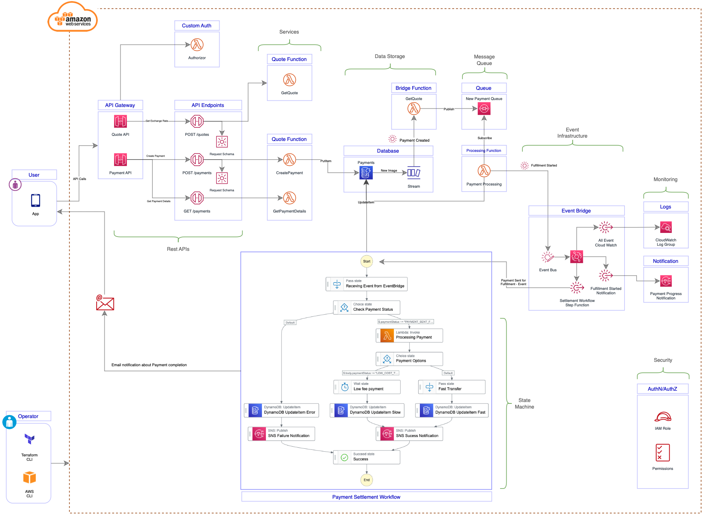
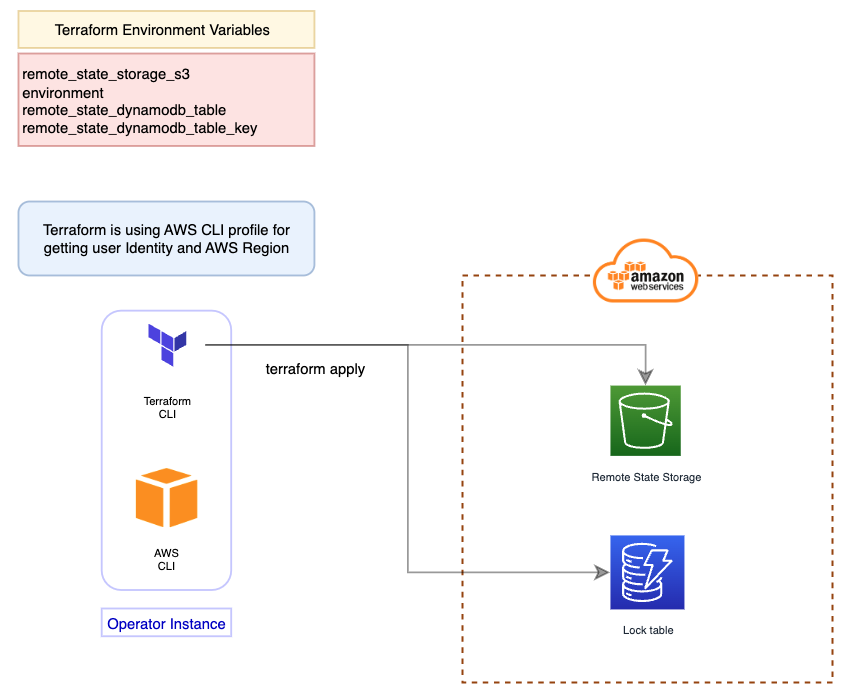
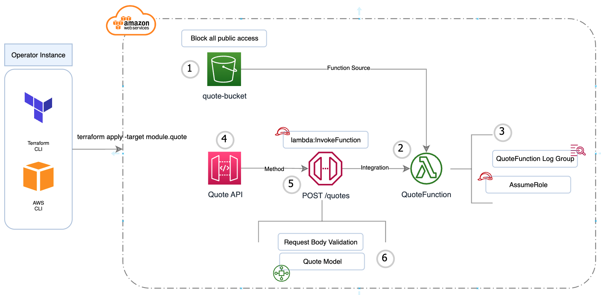
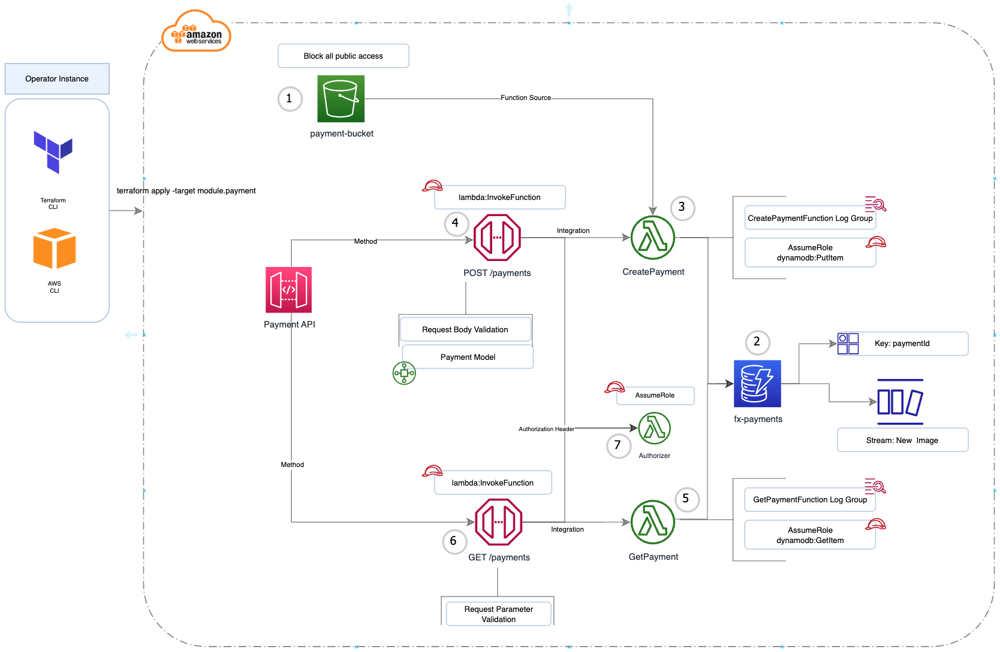
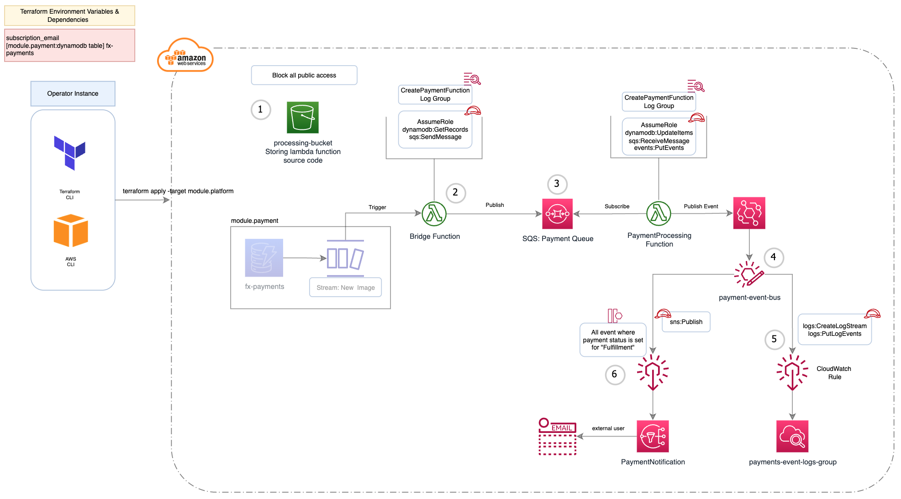
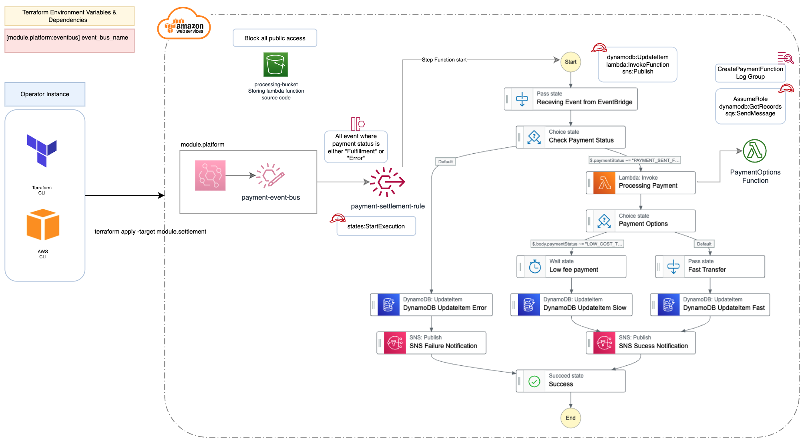

# Automate Event_drive (Serverless) Deployment Architecture using Terraform

This repository giving you realistic use case that built on AWS serverless technologies and completely automate their deployment using terraform. Infrastructure as a Code (IaC) help improving overall Consistency, Automation, Security, Reliability and Collaboration of an Event-Driven (Serverless) Architecture. 

The objective of this repository is to bring the value of the solution that addresses complexity introduced during the deployment of event-driven (serverless) architecture. We have build end2end working model  that uses many AWS serverless technologies and patterns to simulate realistic application and deployment architecture.

## Application Architecture

Architecture is consist of capabilities that includes API gateway, Lambda functions, Dynamodb, Streams, SQS, EventBridge (Bus and Rules), SNS, CloudWatch and Step functions with IAM role and permissions. 

  

## Deployment Building Blocks

Terraform is used for running and managing  the overall deployment architecture. Terraform consist of 4 application deployment module and one base report storage setup project:

- Remote storage - This is an separate terraform project that responsible of creating S3 bucket and DynamoDb table for storing the LockID for all 4 terraform modules mentioned below.

- Quote module - creating Quote API sources and Lambda function to calculate the Rate.

- Payment module - creating Payment API sources, Lambda function and DynamoDB table to create, store and get payment details.

- Processing  module - steam payment details to queue, creating lambda function to consume messages, sending messages to Event Bridge and creating events for CloudWatch, SNS notification and Step Function.

- Settlement module - creating Step function and associated stages that involves lambda function, DynamoDB and SNS Notification services.

| Module Name | Description | Path | Depended On |
|-------------|-------------|------|-------------|
| quote       | Creates Quote API and Backend function| ./Quotes | |
| payment     | Creates Payment API, Backend functions and Database| ./Payment| |
| platform| Creating Processing components such as Db Stream, Queue and Event Bridge | ./ProcessingPlatform | payment |
|  settlement | Creates settlement workflow using State Machine| ./Settlement | platform |

TFRemoteStorage folder has terraform code that will build the required S3 bucket and DynamoDB table to store and track the state of the deployment.

### Why do we need remote state storage?

By default, Terraform stores the state of your infrastructure in a local file on your machine. However, as your infrastructure grows and becomes more complex, managing the state file manually can become increasingly difficult and error-prone. That's where remote state storage comes in.

Remote state storage is a way to store the state of your infrastructure in a centralized location, such as a remote server or a cloud storage service, that can be accessed by multiple members of your team. Terraform provides a number of built-in remote state storage options, including Amazon S3, Azure Blob Storage, Google Cloud Storage, and HashiCorp Consul.

Using remote state storage with Terraform provides several benefits:

1. Collaboration: Multiple members of your team can access and modify the same state file, without having to manually share the file or risk conflicts.

2. Security: Remote state storage can be configured with access controls and encryption to ensure that your infrastructure state remains secure.

3. Consistency: Remote state storage ensures that your infrastructure state is consistent across all team members and environments, which helps to prevent configuration drift and other issues.

4. Scalability: Remote state storage can scale to support large and complex infrastructures,whereas a local state file can become unwieldy and difficult to manage.

Overall, remote state storage is an essential component of using Terraform in production environments. It helps to ensure that your infrastructure remains consistent, predictable, and secure, even as it grows and evolves over time.

# Installation Instructions

## Prerequisite  

- You need to have AWS CLI installed and access configured for the user.
- Also make sure that you have aws region configure in default or custom profile.
- You also need terraform cli installed
- Clone this repository on your local drive

## Step 1 - Terraform Remote Storage 

In the project root, run following commands

```
cd TFRemoteStorage
terraform init
terraform plan
terraform apply
```

This will create required remote state storage components. 

  

## Step 2 - Quote API and Backend Function 

In the project root, run following commands

```
terraform init
terraform plan
terraform apply -target module.quote
```

Following step is deploying QuoteFunction that has logic to provide different rates to the user, QuoteFunction is exposed to the app via REST API endpoint. 



## Step 3 - Payment API, Backend Function and Database 

In the project root, run following commands

```
terraform init
terraform plan
terraform apply -target module.payment
```
Step 3 is all about building the Payment functionality by using Lambda functions that create payment records in dynamodb database and also retrieve updated payments and expose to App using API gateway. 

We are also configuring DynamoDB stream that will be use in the next step, Stream will get new payment records and trigger lambda function that will process those records. 

DynamoDB steam allow capturing a time-ordered sequence of item-level modifications made to DynamoDB tables and take actions based on those modifications.



## Step 4 - Payment Processing (Event infrastructure) 

Provide values for following parameters in **ProcessingPlatform/00_data.tf**

| Variable | Description |
|----------|-------------|
| subscription_email| Email notification will be send to following email address|

In the project root, run following commands

```
terraform init
terraform plan
terraform apply -target module.platform
```
Step 4 is all about creating event infrastructure, in the step we build SQS, EventBridge and couple of pattern matching rules.

In Amazon EventBridge, an event rule is an AWS resource that defines the criteria for matching events and the actions to take when a match is found. When an payment event occurs, the event is sent to CloudWatch and SNS that matched against the rules defined.



## Step 5 - Settlement Workflow (State Machine) 

Step 5 is the core of the backend services, it creates new EventBridge rule that trigger the Step function (State Machine) and run the Payment settlement workflow.

In the project root, run following commands

```
terraform init
terraform plan
terraform apply -target module.settlement
```

A state machine consists of a set of states, transitions, and inputs that define the logic and flow of the application. Each state represents a discrete step in the process, and the transitions define the conditions under which the state machine moves from one state to another. The input provides the initial data or trigger that starts the state machine, and subsequent inputs can be used to modify the state and trigger different transitions.



## Testing

**./curl.cmd** has instructions to test API endpoints. 

## Clean-up

To clean-up all previous steps.

```
terraform destroy -target module.settlement
terraform destroy -target module.platform
terraform destroy -target module.payment
terraform destroy -target module.quote
cd TFRemoteStorage
terraform destroy
```

# Thanks
